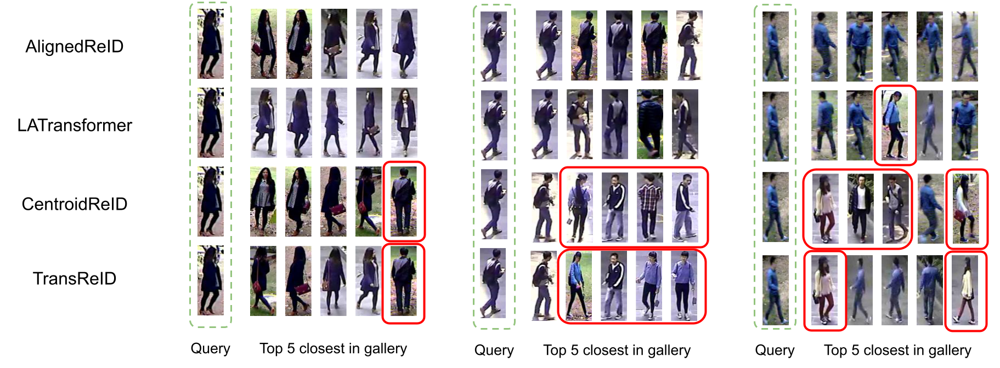
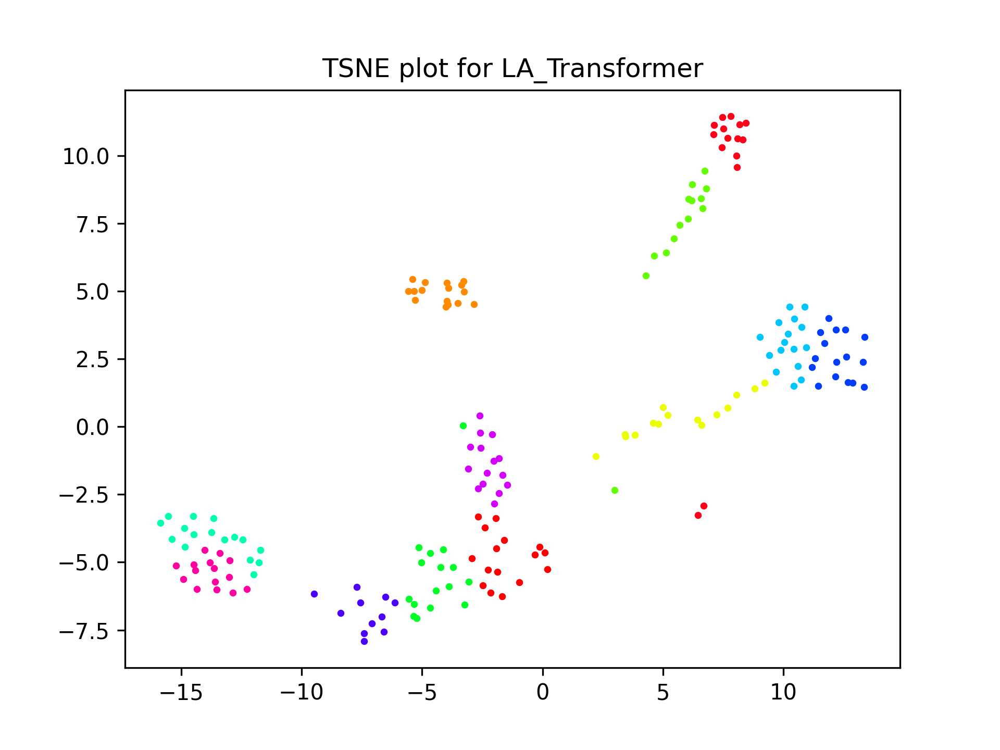
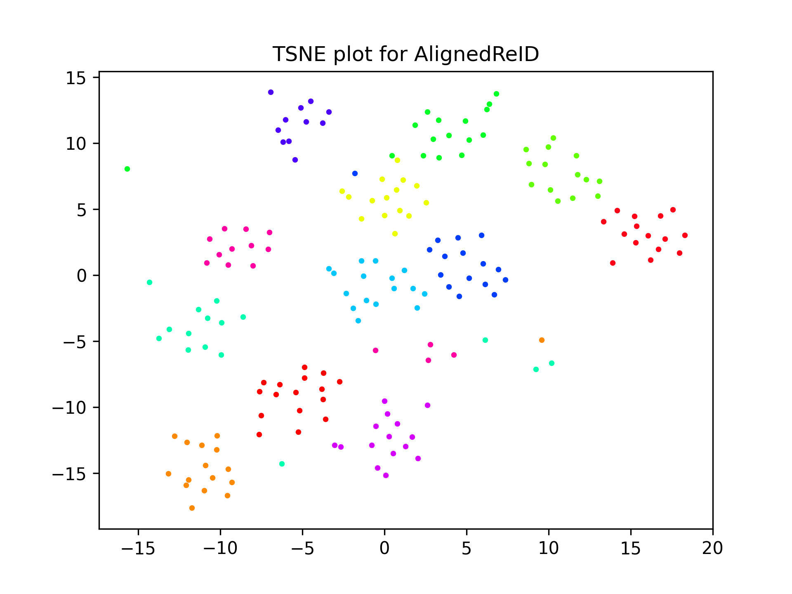

# Person Re Identification

[Mustafa Chasmai](https://github.com/mustafa1728) | [Tamajit Banerjee](https://github.com/tamajit-banerjee)

Experiments on some existing Re-ID methods on a different dataset with qualitative and quantitative analyses of their performance along with proposals to improve the results further.

Part of course project of COL780 2021 taken by Prof. Chetan Arora. 

### Description

A detailed description of the approach used can be found in the report [here](./assets/report.pdf).

### Baselines

- AlignedReID [[paper](https://arxiv.org/abs/1711.08184)][[paper](https://www.sciencedirect.com/science/article/pii/S0031320319302031?casa_token=i87oHbS1tg0AAAAA:91ksksd2huP72e0nzDKFLtnJU3hAYHx4mm-dpBxwdjEYJdHjf8xFIXwSXrVIaW2Wn_Ociqy8xA)]

- LA Transformer [[paper](https://arxiv.org/abs/2106.03720)]

- Centroids ReID [[paper](https://arxiv.org/abs/2104.13643)]

- TransReID [[paper](https://arxiv.org/abs/2102.04378)]

  
   The top 5 closest images in the gallery for a few querry images with the baselines

  
  
   t-SNE plots

For further details and description of the proposed methods, please refer to the report [here](./assets/report.pdf).
